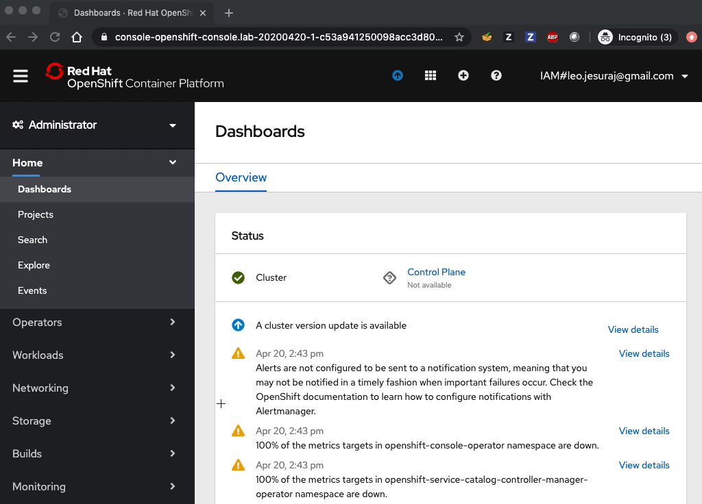

# Login to OpenShift using web terminal

## Access the web terminal

The web terminal runs in your Openshift cluster. It gives you command line access to many tools you will use in the workshop. 

To access the web terminal:

1. From the OpenShift web console, navigate to **Networking** > **Routes**.  Select Project `lab` from the drop-down list and click on the URL of route `tools` (listed under `Location` column). 

1. Click on `Log in with OpenShift`

1. Click on `Allow selected permissions`

    - Note: The authorization permission page above may not display again in the subsequent access as the information will already be in the browser cookie cache.

1. The web terminal will be displayed. 

1. Enter `ls` to verify that the web terminal lists the files and folders in the directory.

    


## Login to OpenShift

1. From the Openshift console, click on the twisty next to your login name and select `Copy Login Command`.

1. In the new window that pops up, click on `Display Token`:

1. To login to your OpenShift cluster, copy the command under `Log in with this token`, then paste it into the web terminal. The command looks like:

    ```
    oc login --token=<TOKEN> --server=<SERVER Address>
    ```

1. After login, the project last accessed is displayed, and it may or may not be the `default` project shown below:

    ```
    Logged into "<SERVER address" as "<USER>" using the token provided.

    You have access to 56 projects, the list has been suppressed. You can list all projects with 'oc projects'
    
    Using project "default".
    ```

    
